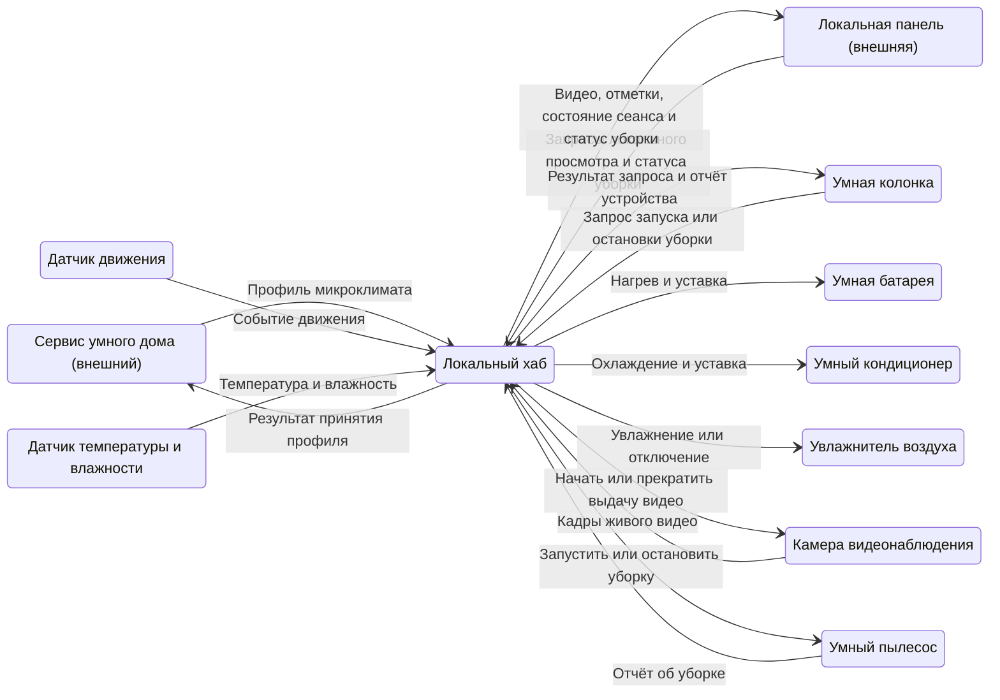

# Исходная архитектура и функциональные связи

```mermaid
stateDiagram-v2
    direction LR
    state "Сервис умного дома (внешний)" as Service
    state "Локальная панель (внешняя)" as Panel
    state "Локальный хаб" as Hub
    state "Умная колонка" as Speaker
    state "Датчик движения" as Motion
    state "Датчик температуры и влажности" as Climate
    state "Умная батарея" as Radiator
    state "Умный кондиционер" as AC
    state "Увлажнитель воздуха" as Humidifier
    state "Камера видеонаблюдения" as Camera
    state "Умный пылесос" as Vacuum
    Service --> Hub: Профиль микроклимата
    Hub --> Service: Результат принятия профиля
    Panel --> Hub: Запросы локального просмотра и статуса уборки
    Hub --> Panel: Видео, отметки, состояние сеанса и статус уборки
    Speaker --> Hub: Запрос запуска или остановки уборки
    Hub --> Speaker: Результат запроса и отчёт устройства
    Motion --> Hub: Событие движения
    Climate --> Hub: Температура и влажность
    Hub --> Radiator: Нагрев и уставка
    Hub --> AC: Охлаждение и уставка
    Hub --> Humidifier: Увлажнение или отключение
    Hub --> Camera: Начать или прекратить выдачу видео
    Camera --> Hub: Кадры живого видео
    Hub --> Vacuum: Запустить или остановить уборку
    Vacuum --> Hub: Отчёт об уборке
```
