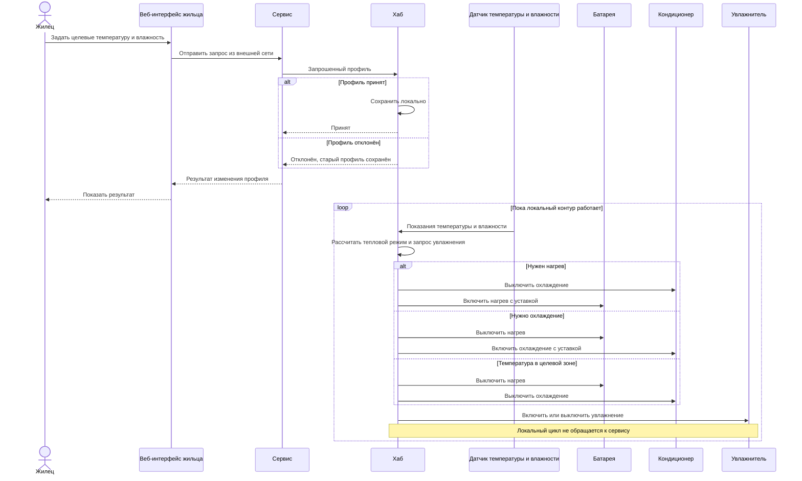

# S-01. Микроклимат на исходной HLA

```mermaid
sequenceDiagram
    actor R as Жилец
    participant W as Веб-интерфейс жильца
    participant S as Сервис
    participant H as Хаб
    participant D as Датчик температуры и влажности
    participant B as Батарея
    participant C as Кондиционер
    participant U as Увлажнитель
    R->>W: Задать целевые температуру и влажность
    W->>S: Отправить запрос из внешней сети
    S->>H: Запрошенный профиль
    alt Профиль принят
        H->>H: Сохранить локально
        H-->>S: Принят
    else Профиль отклонён
        H-->>S: Отклонён, старый профиль сохранён
    end
    S-->>W: Результат изменения профиля
    W-->>R: Показать результат
    loop Пока локальный контур работает
        D->>H: Показания температуры и влажности
        H->>H: Рассчитать тепловой режим и запрос увлажнения
        alt Нужен нагрев
            H->>C: Выключить охлаждение
            H->>B: Включить нагрев с уставкой
        else Нужно охлаждение
            H->>B: Выключить нагрев
            H->>C: Включить охлаждение с уставкой
        else Температура в целевой зоне
            H->>B: Выключить нагрев
            H->>C: Выключить охлаждение
        end
        H->>U: Включить или выключить увлажнение
        Note over H,U: Локальный цикл не обращается к сервису
    end
```
