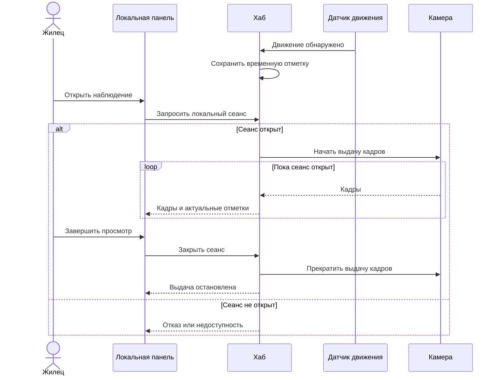

# S-02. Наблюдение на исходной HLA

```mermaid
sequenceDiagram
    actor R as Жилец
    participant P as Локальная панель
    participant H as Хаб
    participant D as Датчик движения
    participant C as Камера
    D->>H: Движение обнаружено
    H->>H: Сохранить временную отметку
    R->>P: Открыть наблюдение
    P->>H: Запросить локальный сеанс
    alt Сеанс открыт
        H->>C: Начать выдачу кадров
        loop Пока сеанс открыт
            C-->>H: Кадры
            H-->>P: Кадры и актуальные отметки
        end
        R->>P: Завершить просмотр
        P->>H: Закрыть сеанс
        H->>C: Прекратить выдачу кадров
        H-->>P: Выдача остановлена
    else Сеанс не открыт
        H-->>P: Отказ или недоступность
    end
```
