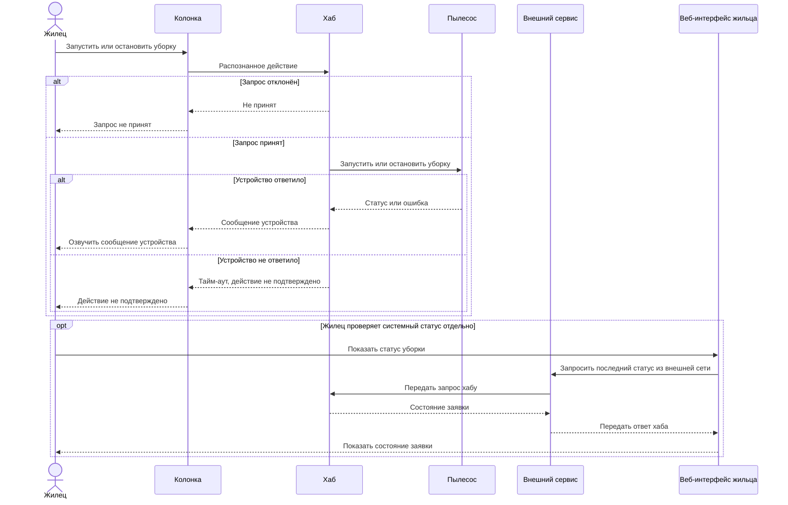

# S-03. Голосовое управление уборкой на исходной HLA

```mermaid
sequenceDiagram
    actor R as Жилец
    participant K as Колонка
    participant H as Хаб
    participant V as Пылесос
    participant S as Внешний сервис
    participant W as Веб-интерфейс жильца
    R->>K: Запустить или остановить уборку
    K->>H: Распознанное действие
    alt Запрос отклонён
        H-->>K: Не принят
        K-->>R: Запрос не принят
    else Запрос принят
        H->>V: Запустить или остановить уборку
        alt Устройство ответило
            V-->>H: Статус или ошибка
            H-->>K: Сообщение устройства
            K-->>R: Озвучить сообщение устройства
        else Устройство не ответило
            H-->>K: Тайм-аут, действие не подтверждено
            K-->>R: Действие не подтверждено
        end
    end
    opt Жилец проверяет системный статус отдельно
        R->>W: Показать статус уборки
        W->>S: Запросить последний статус из внешней сети
        S->>H: Передать запрос хабу
        H-->>S: Состояние заявки
        S-->>W: Передать ответ хаба
        W-->>R: Показать состояние заявки
    end
```
