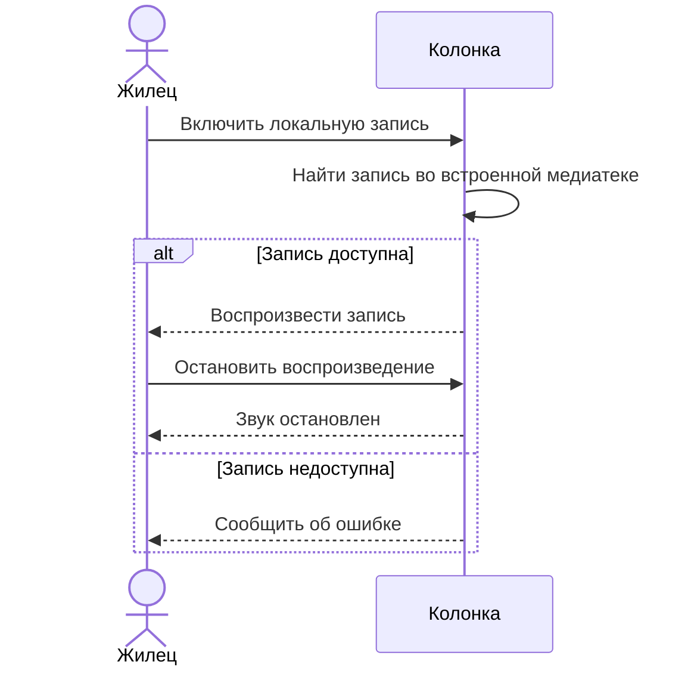

# S-04. Музыка на исходной HLA

```mermaid
sequenceDiagram
    actor R as Жилец
    participant K as Колонка
    R->>K: Включить локальную запись
    K->>K: Найти запись во встроенной медиатеке
    alt Запись доступна
        K-->>R: Воспроизвести запись
        R->>K: Остановить воспроизведение
        K-->>R: Звук остановлен
    else Запись недоступна
        K-->>R: Сообщить об ошибке
    end
```
