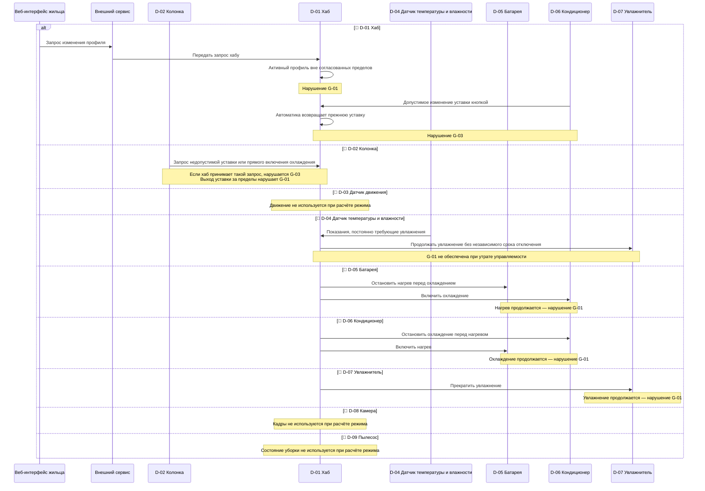

# S-01. Негативные сценарии микроклимата

```mermaid
sequenceDiagram
    participant W as Веб-интерфейс жильца
    participant S as Внешний сервис
    participant K as D-02 Колонка
    participant H as D-01 Хаб
    participant D as D-04 Датчик температуры и влажности
    participant B as D-05 Батарея
    participant C as D-06 Кондиционер
    participant U as D-07 Увлажнитель
    alt 🔴 D-01 Хаб
        W->>S: Запрос изменения профиля
        S->>H: Передать запрос хабу
        H->>H: Активный профиль вне согласованных пределов
        Note over H: Нарушение G-01
        C->>H: Допустимое изменение уставки кнопкой
        H->>H: Автоматика возвращает прежнюю уставку
        Note over H,C: Нарушение G-03
    else 🔴 D-02 Колонка
        K->>H: Запрос недопустимой уставки или прямого включения охлаждения
        Note over K,H: Если хаб принимает такой запрос, нарушается G-03<br/>Выход уставки за пределы нарушает G-01
    else 🔴 D-03 Датчик движения
        Note over H: Движение не используется при расчёте режима
    else 🔴 D-04 Датчик температуры и влажности
        D->>H: Показания, постоянно требующие увлажнения
        H->>U: Продолжать увлажнение без независимого срока отключения
        Note over H,U: G-01 не обеспечена при утрате управляемости
    else 🔴 D-05 Батарея
        H->>B: Остановить нагрев перед охлаждением
        H->>C: Включить охлаждение
        Note over B,C: Нагрев продолжается — нарушение G-01
    else 🔴 D-06 Кондиционер
        H->>C: Остановить охлаждение перед нагревом
        H->>B: Включить нагрев
        Note over B,C: Охлаждение продолжается — нарушение G-01
    else 🔴 D-07 Увлажнитель
        H->>U: Прекратить увлажнение
        Note over U: Увлажнение продолжается — нарушение G-01
    else 🔴 D-08 Камера
        Note over H: Кадры не используются при расчёте режима
    else 🔴 D-09 Пылесос
        Note over H: Состояние уборки не используется при расчёте режима
    end
```
