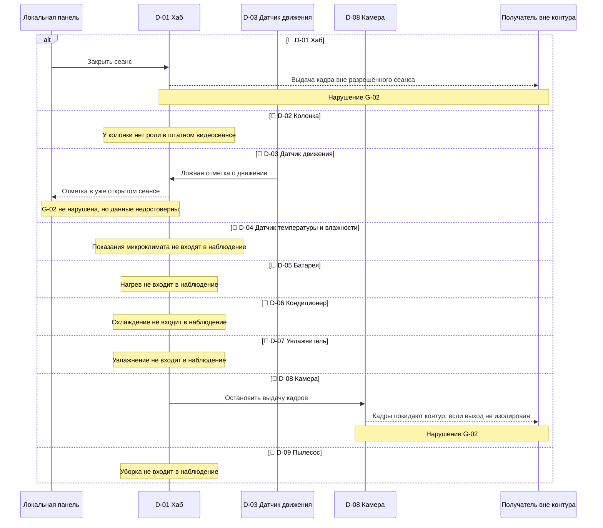

# S-02. Негативные сценарии наблюдения

```mermaid
sequenceDiagram
    participant P as Локальная панель
    participant H as D-01 Хаб
    participant D as D-03 Датчик движения
    participant C as D-08 Камера
    participant O as Получатель вне контура
    alt 🔴 D-01 Хаб
        P->>H: Закрыть сеанс
        H-->>O: Выдача кадра вне разрешённого сеанса
        Note over H,O: Нарушение G-02
    else 🔴 D-02 Колонка
        Note over H: У колонки нет роли в штатном видеосеансе
    else 🔴 D-03 Датчик движения
        D->>H: Ложная отметка о движении
        H-->>P: Отметка в уже открытом сеансе
        Note over P,H: G-02 не нарушена, но данные недостоверны
    else 🔴 D-04 Датчик температуры и влажности
        Note over H: Показания микроклимата не входят в наблюдение
    else 🔴 D-05 Батарея
        Note over H: Нагрев не входит в наблюдение
    else 🔴 D-06 Кондиционер
        Note over H: Охлаждение не входит в наблюдение
    else 🔴 D-07 Увлажнитель
        Note over H: Увлажнение не входит в наблюдение
    else 🔴 D-08 Камера
        H->>C: Остановить выдачу кадров
        C-->>O: Кадры покидают контур, если выход не изолирован
        Note over C,O: Нарушение G-02
    else 🔴 D-09 Пылесос
        Note over H: Уборка не входит в наблюдение
    end
```
