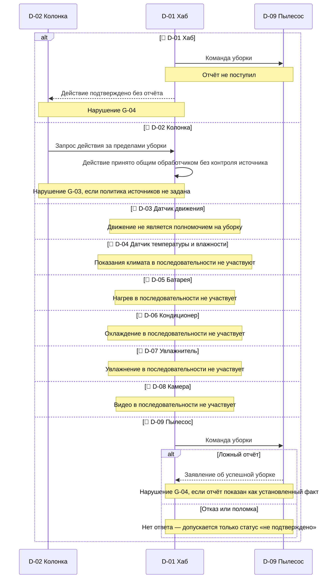

# S-03. Негативные сценарии голосового управления уборкой

```mermaid
sequenceDiagram
    participant K as D-02 Колонка
    participant H as D-01 Хаб
    participant V as D-09 Пылесос
    alt 🔴 D-01 Хаб
        H->>V: Команда уборки
        Note over H,V: Отчёт не поступил
        H-->>K: Действие подтверждено без отчёта
        Note over K,H: Нарушение G-04
    else 🔴 D-02 Колонка
        K->>H: Запрос действия за пределами уборки
        H->>H: Действие принято общим обработчиком без контроля источника
        Note over K,H: Нарушение G-03, если политика источников не задана
    else 🔴 D-03 Датчик движения
        Note over H: Движение не является полномочием на уборку
    else 🔴 D-04 Датчик температуры и влажности
        Note over H: Показания климата в последовательности не участвуют
    else 🔴 D-05 Батарея
        Note over H: Нагрев в последовательности не участвует
    else 🔴 D-06 Кондиционер
        Note over H: Охлаждение в последовательности не участвует
    else 🔴 D-07 Увлажнитель
        Note over H: Увлажнение в последовательности не участвует
    else 🔴 D-08 Камера
        Note over H: Видео в последовательности не участвует
    else 🔴 D-09 Пылесос
        H->>V: Команда уборки
        alt Ложный отчёт
            V-->>H: Заявление об успешной уборке
            Note over H,V: Нарушение G-04, если отчёт показан как установленный факт
        else Отказ или поломка
            Note over H,V: Нет ответа — допускается только статус «не подтверждено»
        end
    end
```
