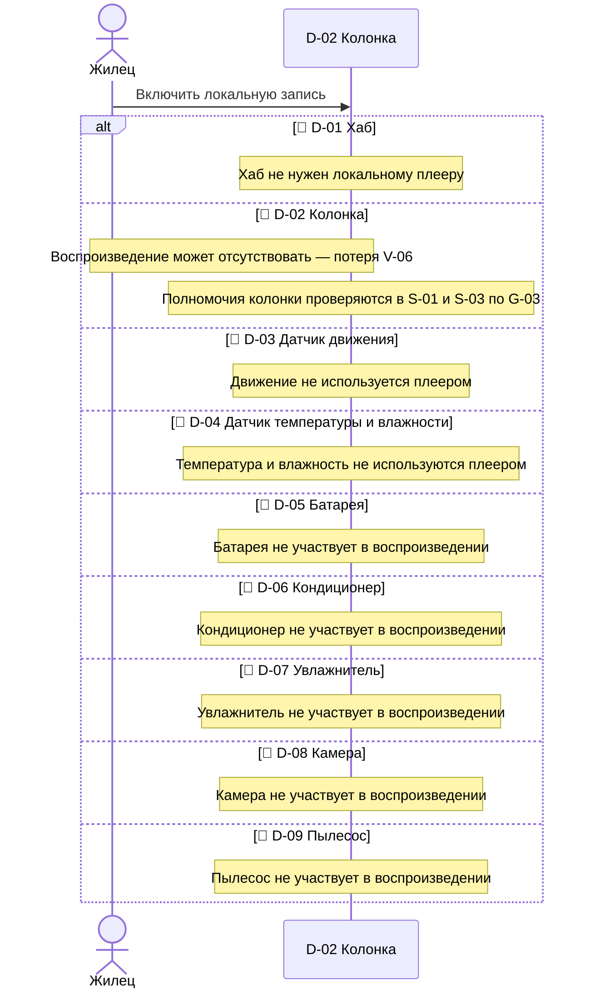

# S-04. Негативные сценарии воспроизведения музыки

```mermaid
sequenceDiagram
    actor R as Жилец
    participant K as D-02 Колонка
    R->>K: Включить локальную запись
    alt 🔴 D-01 Хаб
        Note over K: Хаб не нужен локальному плееру
    else 🔴 D-02 Колонка
        Note over R,K: Воспроизведение может отсутствовать — потеря V-06
        Note over K: Полномочия колонки проверяются в S-01 и S-03 по G-03
    else 🔴 D-03 Датчик движения
        Note over K: Движение не используется плеером
    else 🔴 D-04 Датчик температуры и влажности
        Note over K: Температура и влажность не используются плеером
    else 🔴 D-05 Батарея
        Note over K: Батарея не участвует в воспроизведении
    else 🔴 D-06 Кондиционер
        Note over K: Кондиционер не участвует в воспроизведении
    else 🔴 D-07 Увлажнитель
        Note over K: Увлажнитель не участвует в воспроизведении
    else 🔴 D-08 Камера
        Note over K: Камера не участвует в воспроизведении
    else 🔴 D-09 Пылесос
        Note over K: Пылесос не участвует в воспроизведении
    end
```
