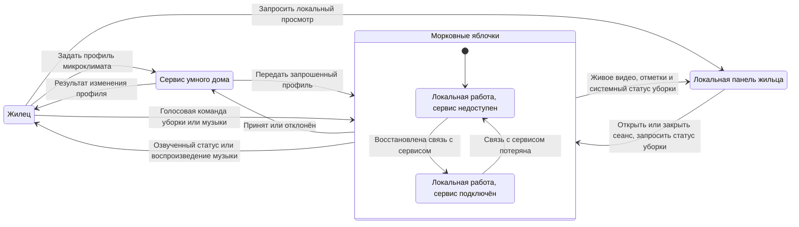

# Контекст системы

```mermaid
stateDiagram-v2
    direction LR
    state "Жилец" as Resident
    state "Сервис умного дома" as Service
    state "Локальная панель жильца" as Panel
    state "Морковные яблочки" as Home {
        [*] --> Local
        state "Локальная работа, сервис недоступен" as Local
        state "Локальная работа, сервис подключён" as Connected
        Local --> Connected: Восстановлена связь с сервисом
        Connected --> Local: Связь с сервисом потеряна
    }
    Resident --> Service: Задать профиль микроклимата
    Service --> Resident: Результат изменения профиля
    Service --> Home: Передать запрошенный профиль
    Home --> Service: Принят или отклонён
    Resident --> Home: Голосовая команда уборки или музыки
    Home --> Resident: Озвученный статус или воспроизведение музыки
    Resident --> Panel: Запросить локальный просмотр
    Panel --> Home: Открыть или закрыть сеанс, запросить статус уборки
    Home --> Panel: Живое видео, отметки и системный статус уборки
```
