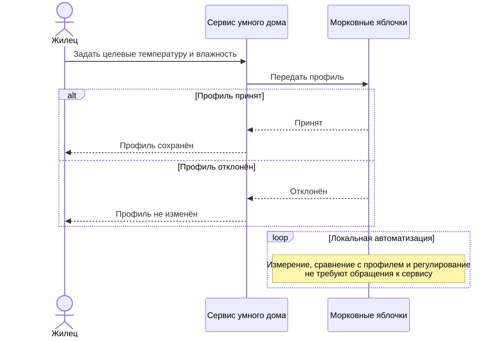

# S-01. Настройка и поддержание микроклимата

```mermaid
sequenceDiagram
    actor R as Жилец
    participant S as Сервис умного дома
    participant H as Морковные яблочки
    R->>S: Задать целевые температуру и влажность
    S->>H: Передать профиль
    alt Профиль принят
        H-->>S: Принят
        S-->>R: Профиль сохранён
    else Профиль отклонён
        H-->>S: Отклонён
        S-->>R: Профиль не изменён
    end
    loop Локальная автоматизация
        Note over H: Измерение, сравнение с профилем и регулирование<br/>не требуют обращения к сервису
    end
```
