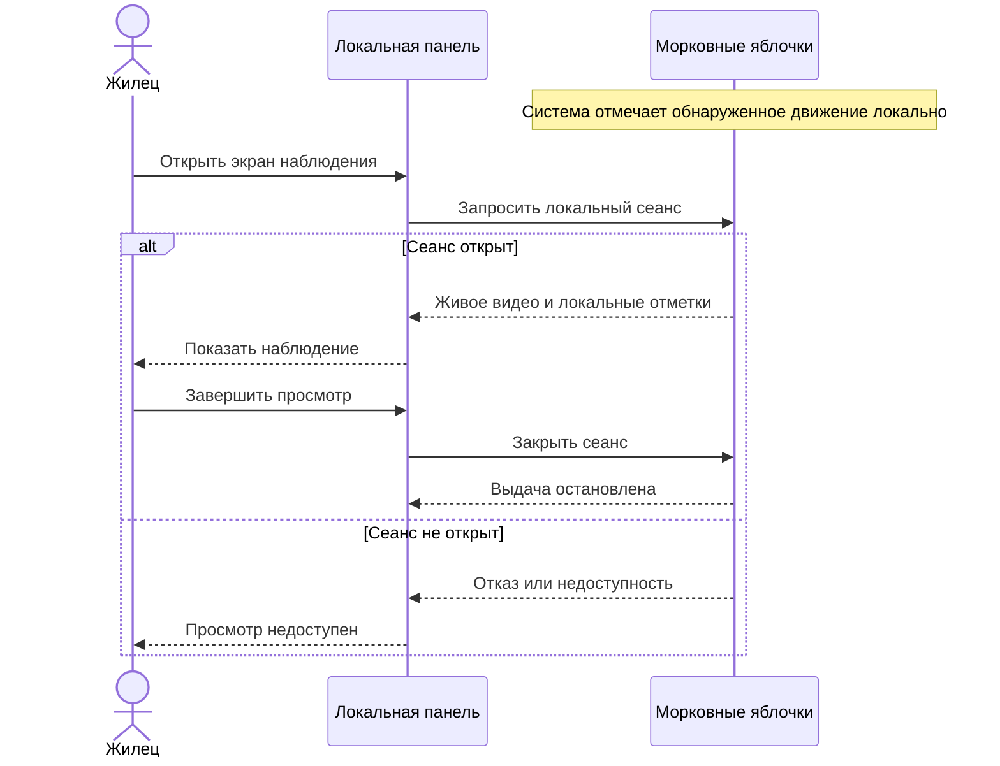

# S-02. Отметки о движении и живое видео

```mermaid
sequenceDiagram
    actor R as Жилец
    participant P as Локальная панель
    participant H as Морковные яблочки
    Note over H: Система отмечает обнаруженное движение локально
    R->>P: Открыть экран наблюдения
    P->>H: Запросить локальный сеанс
    alt Сеанс открыт
        H-->>P: Живое видео и локальные отметки
        P-->>R: Показать наблюдение
        R->>P: Завершить просмотр
        P->>H: Закрыть сеанс
        H-->>P: Выдача остановлена
    else Сеанс не открыт
        H-->>P: Отказ или недоступность
        P-->>R: Просмотр недоступен
    end
```
