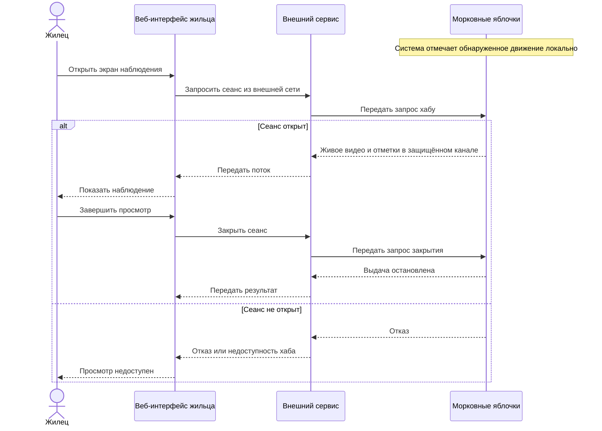

# S-02. Отметки о движении и живое видео

```mermaid
sequenceDiagram
    actor R as Жилец
    participant W as Веб-интерфейс жильца
    participant S as Внешний сервис
    participant H as Морковные яблочки
    Note over H: Система отмечает обнаруженное движение локально
    R->>W: Открыть экран наблюдения
    W->>S: Запросить сеанс из внешней сети
    S->>H: Передать запрос хабу
    alt Сеанс открыт
        H-->>S: Живое видео и отметки в защищённом канале
        S-->>W: Передать поток
        W-->>R: Показать наблюдение
        R->>W: Завершить просмотр
        W->>S: Закрыть сеанс
        S->>H: Передать запрос закрытия
        H-->>S: Выдача остановлена
        S-->>W: Передать результат
    else Сеанс не открыт
        H-->>S: Отказ
        S-->>W: Отказ или недоступность хаба
        W-->>R: Просмотр недоступен
    end
```

При потере интернета или связи с сервисом открыть сеанс нельзя, а текущий просмотр прекращается.
