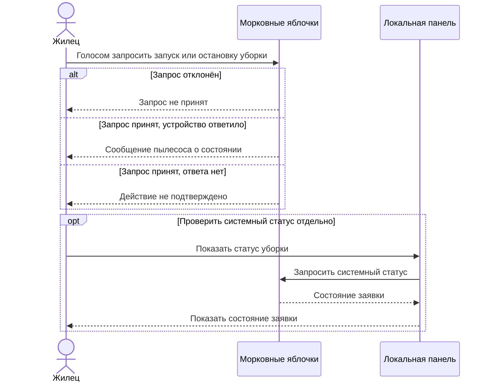

# S-03. Голосовое управление уборкой

```mermaid
sequenceDiagram
    actor R as Жилец
    participant H as Морковные яблочки
    participant P as Локальная панель
    R->>H: Голосом запросить запуск или остановку уборки
    alt Запрос отклонён
        H-->>R: Запрос не принят
    else Запрос принят, устройство ответило
        H-->>R: Сообщение пылесоса о состоянии
    else Запрос принят, ответа нет
        H-->>R: Действие не подтверждено
    end
    opt Проверить системный статус отдельно
        R->>P: Показать статус уборки
        P->>H: Запросить системный статус
        H-->>P: Состояние заявки
        P-->>R: Показать состояние заявки
    end
```
