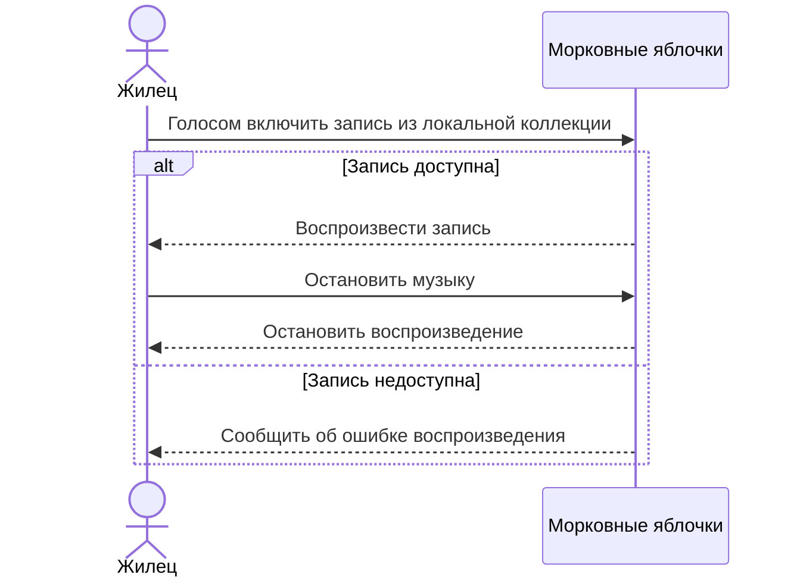

# S-04. Воспроизведение музыки

```mermaid
sequenceDiagram
    actor R as Жилец
    participant H as Морковные яблочки
    R->>H: Голосом включить запись из локальной коллекции
    alt Запись доступна
        H-->>R: Воспроизвести запись
        R->>H: Остановить музыку
        H-->>R: Остановить воспроизведение
    else Запись недоступна
        H-->>R: Сообщить об ошибке воспроизведения
    end
```
